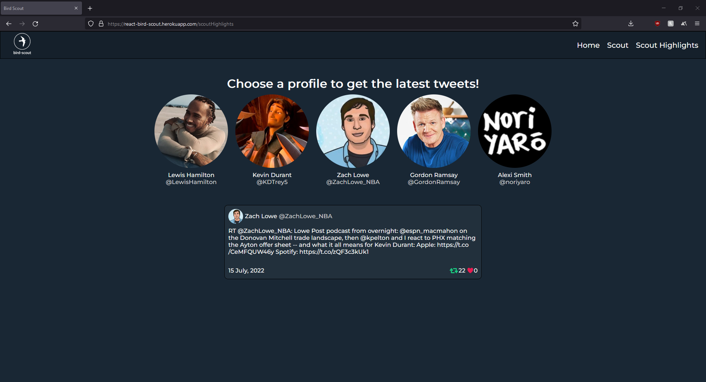

## bird-scout

`bird-scout` is a web application pulling recent tweets from a user or topic from the Twitter API. This project builds upon on the foundation of working with external APIs server-side using credentials to make requests to incorporate the returned data into a React application.

### Summary

Have you ever felt lost in navigating Twitter? Do the threads make you confused in following a conversation? `bird-scout` allows you to skim the surface on the latest talks regarding a topic and even the latest tweets from a particular person. Begin scouting for a specific person using the `@username` format or simply type a topic `(i.e. nba summer league)` to scout on the opinions of other folks.

`bird-scout` is a React, nodejs application that displays recent tweets based on the user inputs. The Twitter API requires credentials to make requests so this required a back-end to securely handle HTTP requests between the client and Twitter's API. This project was very beneficial in working with React's components and hooks, but also working with external APIs. I heavily struggled understanding the communication between the client, server, and external APIs; however, it is vital in using a back-end to maintain the integrity of sensitive information that's being passed back and forth from the client to the API.

### Installation Instructions
1. In the root of the project, run `npm run install` in the terminal.
2. Create a Twitter account and navigate to the  to create a `Bearer` token.
3. Clone the `.env_template` file in the `server` folder, rename it to `.env` and replace the `Bearer` token with its appropriate value from the developer portal.
4. In the `server` folder of the project, run `npm run dev-start` in the terminal.
